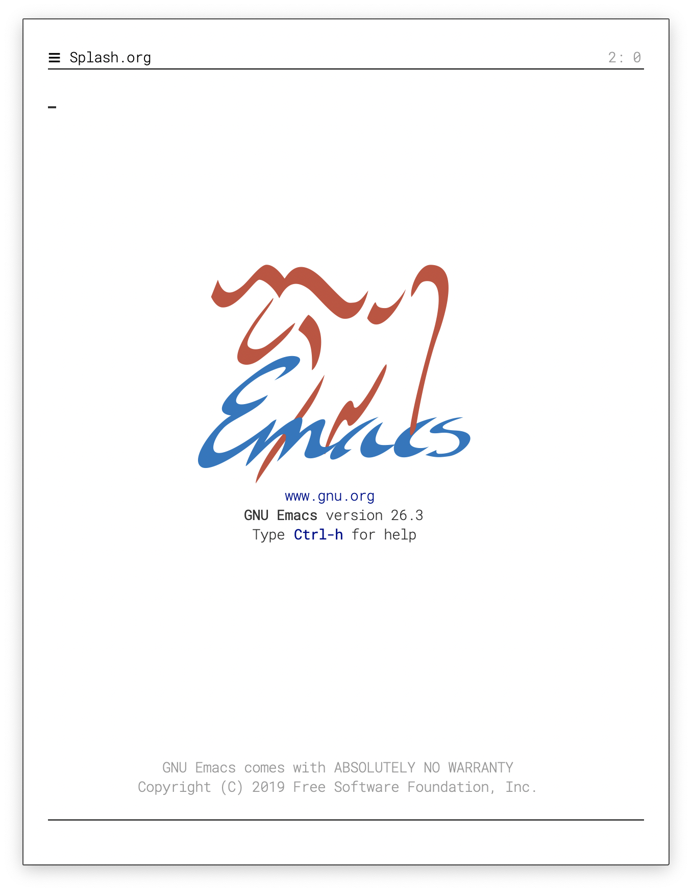
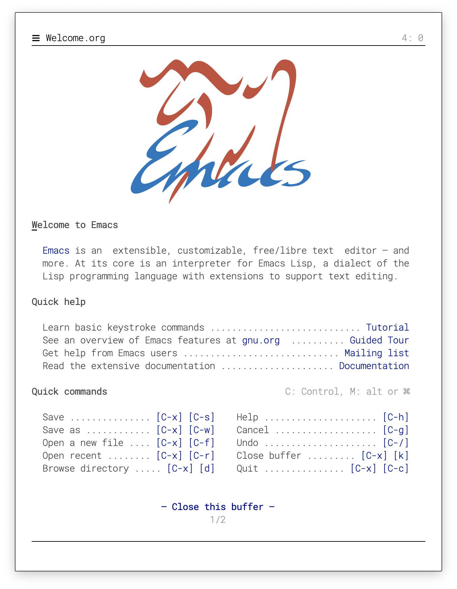
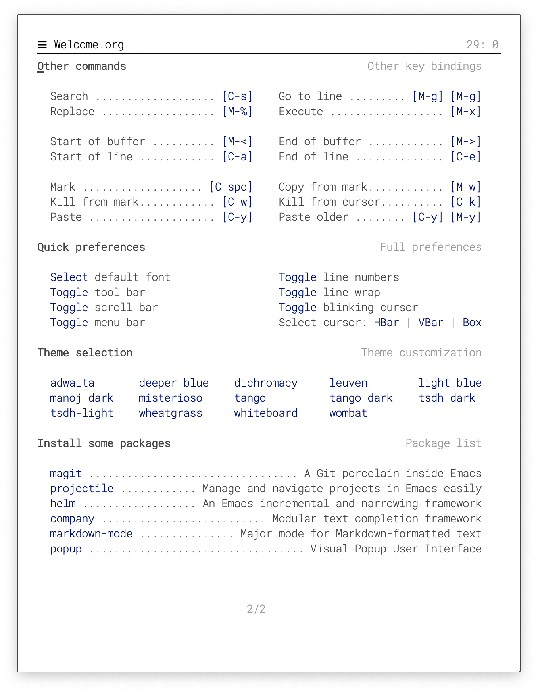
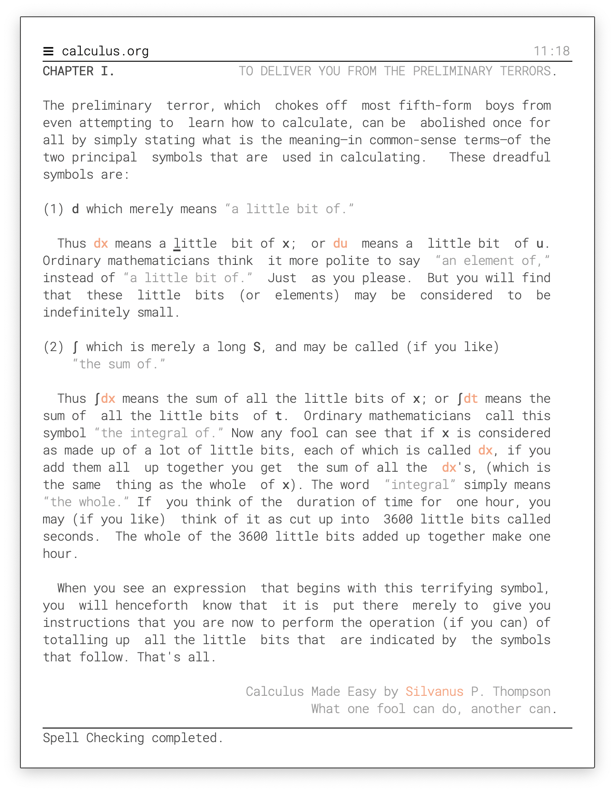
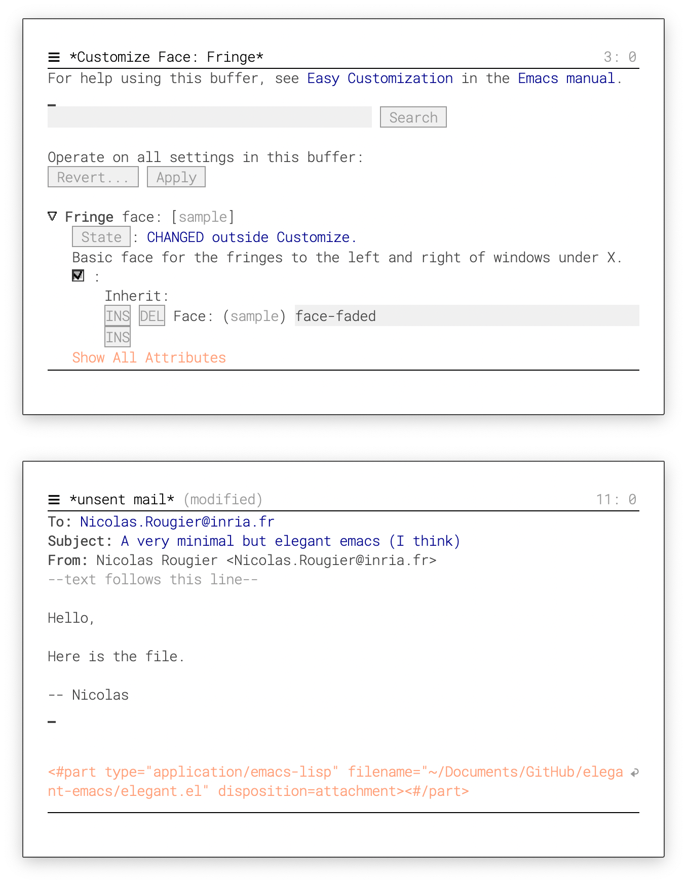
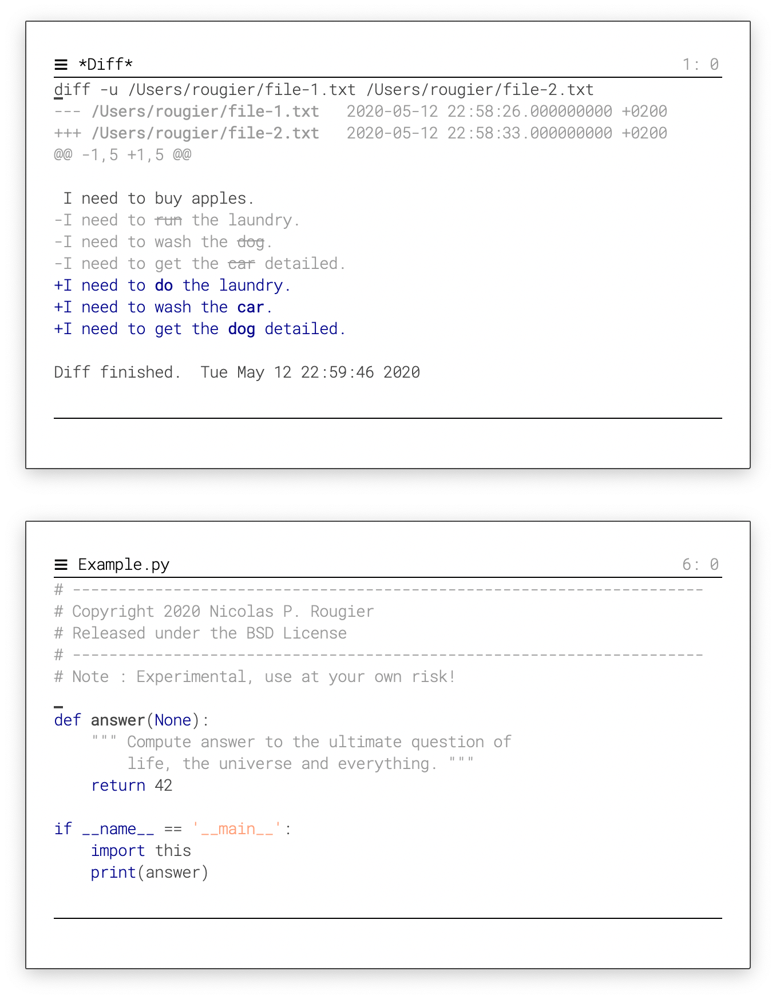
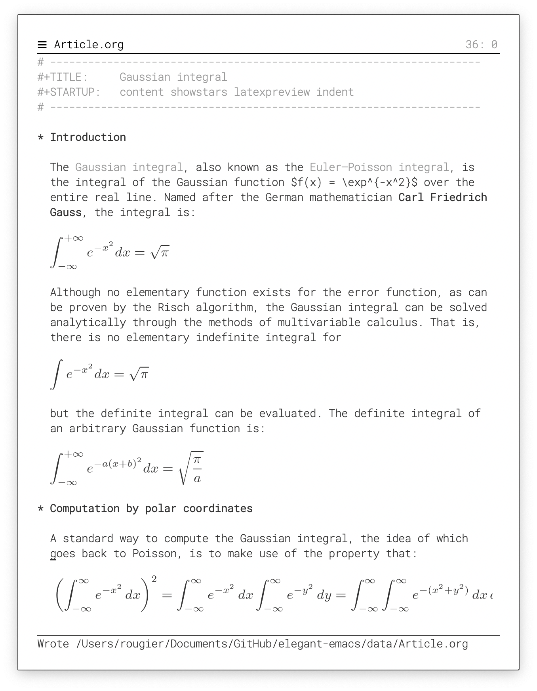
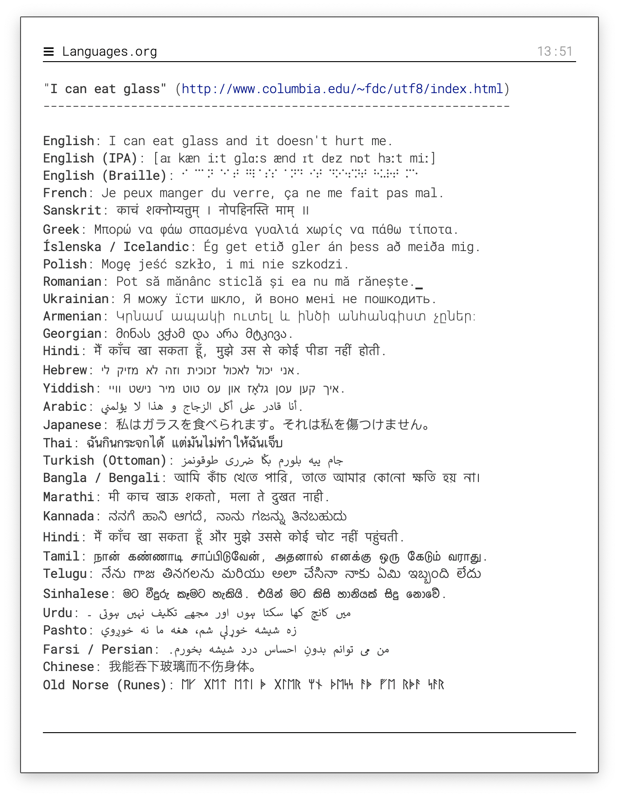
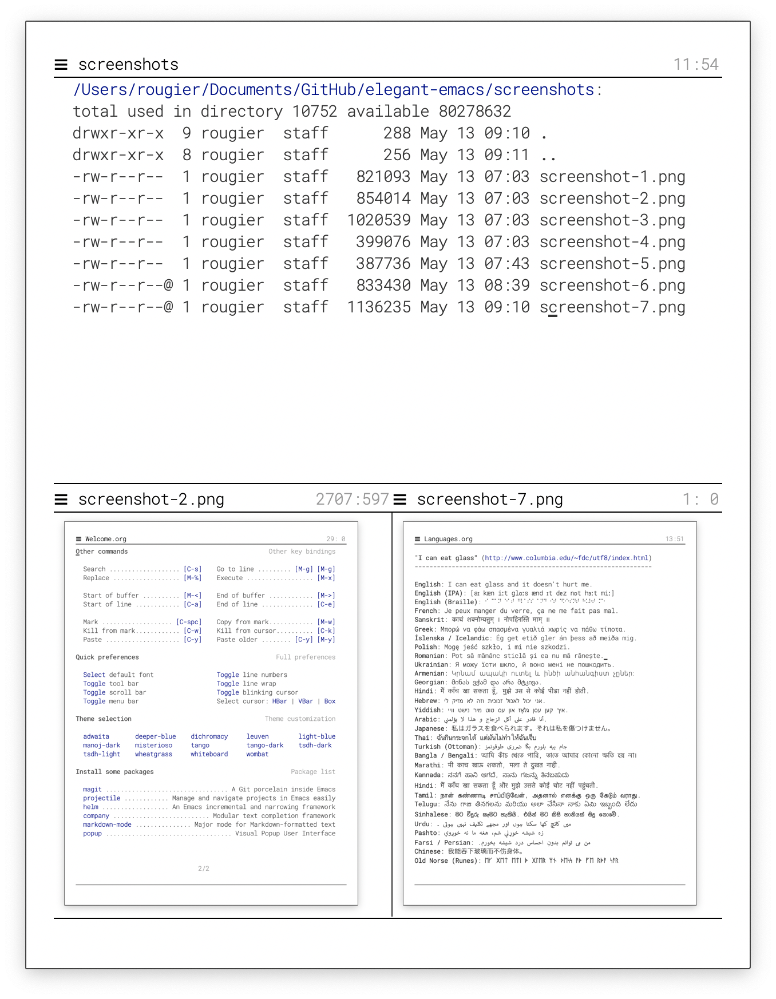

# elegant-theme: A fork of elegant-emacs as a standard Emacs theme

The default theme style is previewed in [Rougier's](https://github.com/rougier/elegant-emacs) original README. See the next section. 

> *Note*: This repo. is only for ease of updating this theme. All copyrights reserved to [Rougier](https://github.com/rougier/elegant-emacs).

To use this theme, clone it and place anywhere your `load-path`
searches. Then copy the following into your init files:

```lisp
(require 'elegant-theme)
(load-theme 'elegant-light t)
```

or, use `use-package`:

```lisp
   (use-package elegant-theme
     :ensure nil
     :demand
     :load-path "YOUR_PATH/elegant-theme"
     :init
     ;; set nil to use elegant-emacs's headline to replace Emacs modeline
     ;; if you prefer Emacs-style modeline (e.g., doomline etc.), set to "t"
     (setq elegant-modeline-disabled nil))
   ;; load the theme
   (load-theme 'elegant-light t)
```

> :warning: The dark elegant theme has not yet been made.

*Rougier's original README goes as follows*:

# A very minimal but elegant emacs (I think)

The goal is to have a minimal consistent vanilla emacs (i.e. no
package) and yet elegant.  
The defaul font is [Roboto Mono](https://fonts.google.com/specimen/Roboto+Mono)
and optionally, you'll also need the [Fira Code](https://fonts.google.com/specimen/Fira+Code) font.

**Usage**: `emacs -q -l sanity.el -l elegance.el Splash.org &`


